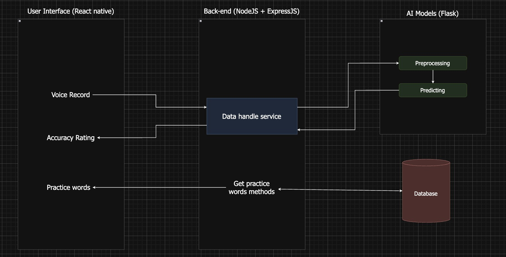
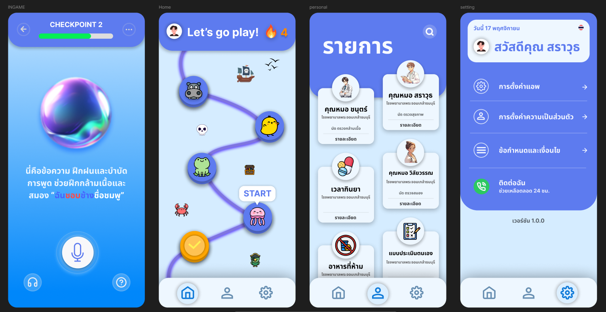

# Speech Therapy Game Application
### Developed for the **27th National Software Contest (NSC)**

## About the Project
Developed for the **27th National Software Contest (NSC)**, this project focuses on enhancing speech therapy through AI-powered, interactive game-based methods.

This application is a **speech therapy game app** designed to help individuals improve their speech clarity through fun and engaging stages.  
It primarily targets users with speech difficulties caused by conditions such as:
- Spinocerebellar Degeneration (SCD)
- Amyotrophic Lateral Sclerosis (ALS)
- Cerebral Palsy (CP)
- Brainstem Stroke
- And other motor speech disorders

The application features three main modules:
1. **Play Mode (Game Stages)**  
   - Users practice speaking sentences correctly.
   - The app uses **OpenAI Whisper** for real-time speech recognition and feedback.
2. **Medical Info Management**  
   - Users can log medical appointments, medication schedules, and personal health notes.
3. **General Settings**  
   - Adjust app settings such as language, audio, and interface preferences.

---

## System Structure

## UX/UI Design

---

## Technologies Used  
The project utilizes the following technologies to deliver a seamless and engaging experience:

- **OpenAI Whisper** – A speech-to-text model for detecting spoken accuracy.  
  OpenAI Whisper is used for real-time speech recognition, ensuring that users receive immediate feedback on their pronunciation and speech clarity.

- **React Native** – A front-end framework for building cross-platform mobile applications.  
  React Native enables the app to run efficiently on both iOS and Android platforms, providing a smooth and consistent user experience.

- **Flask** – A backend framework for managing data and server-side logic.  
  Flask is used to handle server-side processes, manage data flow, and support user authentication and medical info management.

---